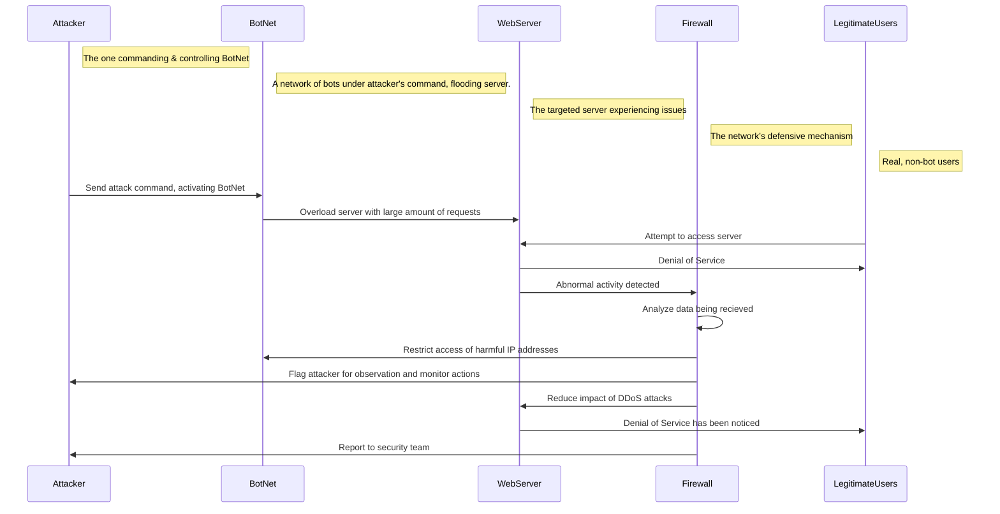

### Sequence Breakdown: 

1. **Attacker Sends Command**: In the first step, the attacker sends out the command for the bots to launch a DDoS and overwhelm the system. 
  
2. **BotNet Overwhelms WebServer**: The botnet floods the web server with a huge volume of requests. The web server gets overwhelmed and cannot manage the legitimate users.

3. **Legitimate User Attempts To Access Server**: An actual, non-bot server attempts to acces the web server.

4. **Legitimate User Is Denied Service**: Due to the overwhelm of the netbot requests, the web server cannot handle the legitimate user, causing a denial of service.  
  
5. **WebServer Alerts Firewall**: The web server detects abnormal activity and sends an alert to the firewall.
  
6. **Firewall Analyzes Traffic**: The firewall begins analyzing the traffic data to identify patterns that suggest a DDoS attack.
  
7. **Firewall Restricts Malicious IPs**: Based on its data analysis, the firewall blocks the IP addresses of the bots involved in the attack.
  
8. **Firewall Flags And Monitors Attacker**: The firewall flags and monitors the attacker’s traffic to prevent further malicious actions.
  
9. **Firewall Reduces Impact of Attack**: The firewall continues to block further activity of the botnet, allowing legitimate traffic to reach the web server.
  
10. **Web Server Users Still Experiencing Service Issues**: The server may still be overwhelmed and unable to serve legitimate users initially.

11. **Firewall Generates Alert**:The firewall generates an alert based on the attack, which will be reviewed by the security team for further analysis and action. 
  
